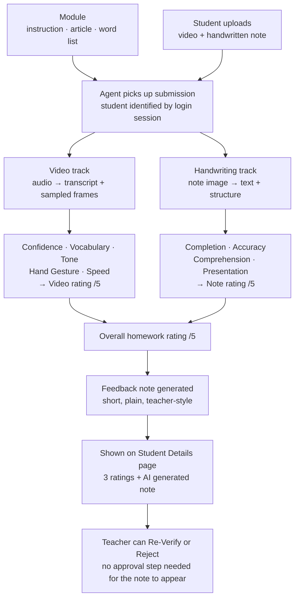
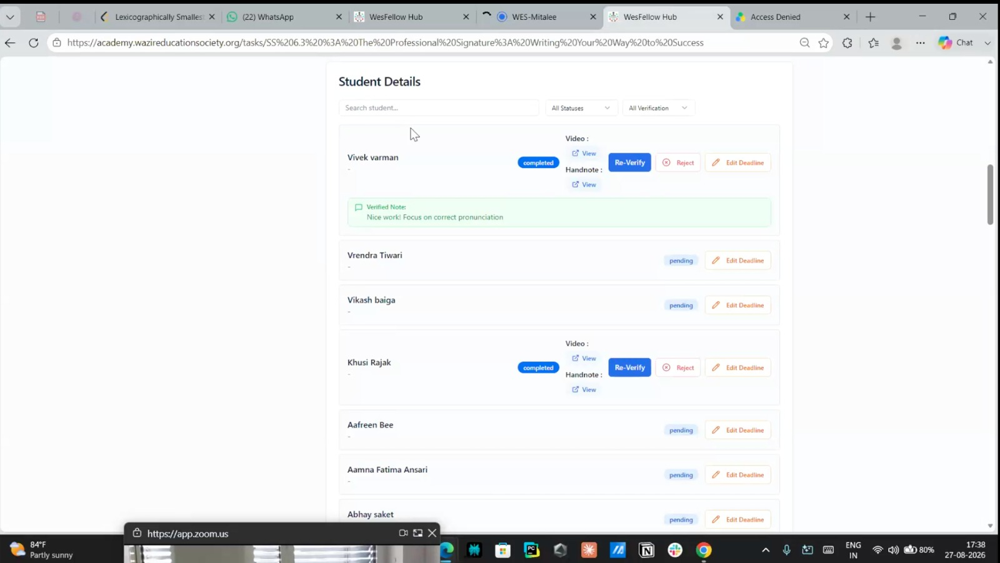
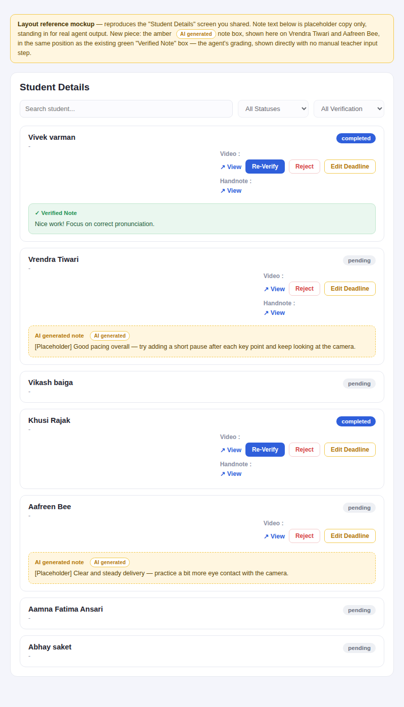
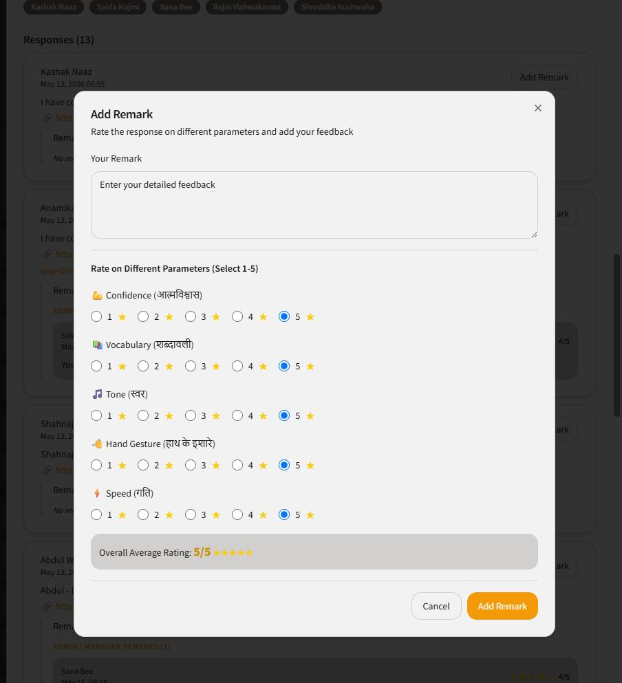
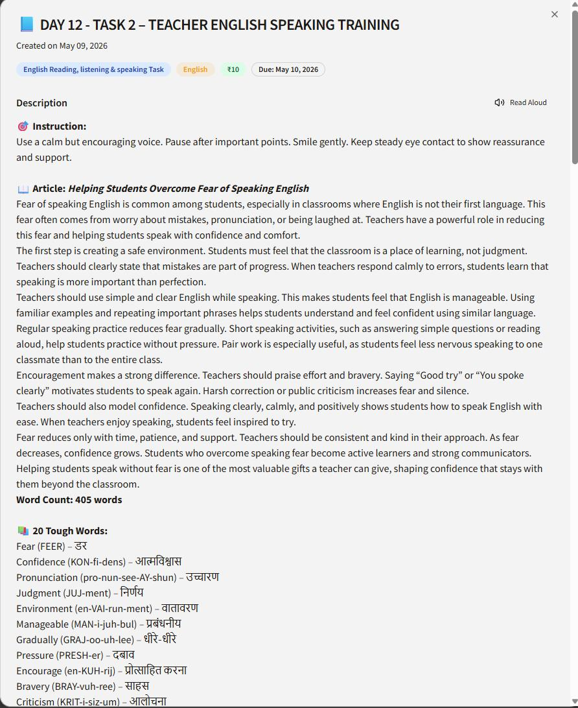
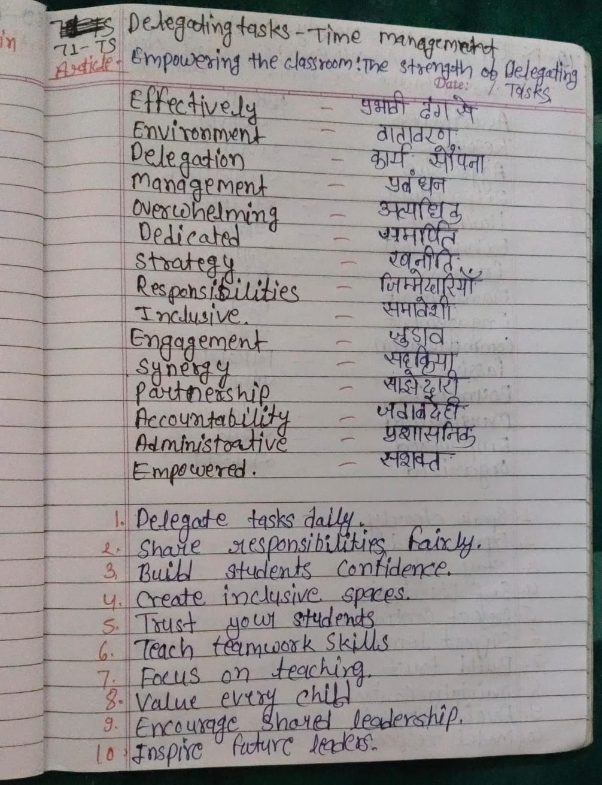

# Homework Grading Agent

## Problem statement

For teachers, help them do grading of homework. Too many classes, too many students, and homework
for each period is difficult to manage — we need an agent to help them.

### The scale of the problem

One teacher, 6 periods a day, 35–40 students per class, homework set each period:

| | Per teacher |
|---|---|
| Submissions per day | **210–240** |
| Artifacts per day (video + note each) | ~420–480 |
| Submissions per 5-day week | ~1,050–1,200 |
| Submissions per month (20 teaching days) | ~4,400 |

Four consequences fall straight out of those numbers, and they shape the rest of this design:

| Consequence | Why | What it means for the build |
|---|---|---|
| **Grade as an overnight batch, not on upload** | Homework goes out through the day and arrives by evening; nothing needs a score within seconds | Batch processing — cheaper and simpler than real-time, with no reason to pay for the latter |
| **Cost per submission decides viability** | ~4,400 submissions per teacher per month; transcription + vision + generation costs multiply fast | Calculate against real provider pricing **before** building, not after |
| **Retention policy is a cost issue, not only privacy** | A couple of minutes of video per submission is several GB of student video per teacher per day | Auto-delete working files after grading (also listed Critical under governance below) |
| **Grading must publish automatically** | No teacher reviews 220 gradings a day | Confirms the no-approval-gate decision — and makes the flag rate a hard constraint: ~10% flagged is ~22/day and workable; flag half and the original problem is back |

## Job to be done (JTBD)

Help teachers grade homework submitted by students as a video recording, where the student reads
from the assigned module. The agent evaluates each video on five parameters — **Confidence,
Vocabulary, Tone, Hand Gesture, Speed** — and shows an overall average rating out of 5. The
student's handwritten note is graded the same way on its own set of parameters. Each homework
submission therefore produces **three ratings and one written feedback note**: a video rating, a
handwritten-note rating, and an overall rating for that homework — see
[Ratings and how they combine](#ratings-and-how-they-combine).

## How the agent works

The agent runs per submission. It never infers *which* student a file belongs to — identity comes
from the login session the file was uploaded under. Module content (instruction, article, word
list) is what the submission is graded *against*, so one rubric works across every module without
a teacher writing a new one each time.



Stage by stage:

| Stage | What happens |
|---|---|
| 1. Ingest | Pull the module's instruction, article text and word list, plus the student's uploaded video and handwritten note |
| 2. Video track | Extract audio → transcript with word-level timings; sample frames across the clip |
| 3. Handwriting track | Read the note image → vocabulary entries, translations, numbered points |
| 4. Score | Rate the five video parameters and the four note parameters, each 1–5, then derive the video, note and overall ratings |
| 5. Feedback | Turn the scores into a short, student-readable note |
| 6. Publish | Write the three ratings and the note back to the Student Details screen — visible immediately, no manual approval |
| 7. Override | Teacher may Re-Verify or Reject afterwards; that acts on an already-complete grade |

## Current UI — where the agent's output shows up

This is the existing "Student Details" screen (WesFellow Hub, `academy.wazireducationsociety.org`)
and it's the page the agent will continue to work inside of — grading happens behind the scenes,
and the result (status, verified note) surfaces here per student.



Each student row shows a status (`completed` / `pending`), links to the uploaded **Video** and
**Handnote**, and — once graded — a note summarizing the feedback (currently a manually-entered
"Verified Note"; see [Grading parameters](#grading-parameters) below for what the agent should be
generating automatically instead).

### Target state — where the teacher's evaluation / feedback is shown

The layout stays exactly as above. The only change is a new note block carrying the agent's
output, sitting in the same position the existing green "Verified Note" occupies:



The AI note is visually distinct from a teacher's verified note (amber, dashed border, tagged
`AI generated`) so it is always clear which is which. It appears as soon as the agent has graded
the submission — **there is no approve/edit step and no manual input required from the teacher**
for it to show. The existing `Re-Verify` and `Reject` controls stay where they are, so a teacher
can still act on a submission after the fact; they simply are not a gate the grade waits behind.

Markup for the note block:

```html
<div class="note-box ai-pending">
  <div class="note-label">AI generated note <span class="ai-tag">AI generated</span></div>
  Good pacing overall — try adding a short pause after each key point and keep looking at the camera.
</div>
```

```css
.note-box.ai-pending {
  background: #fff6e0;
  border: 1px dashed #f2c94c;
  color: #5c4400;
  border-radius: 9px;
  padding: 10px 12px;
  font-size: 12.5px;
  line-height: 1.5;
  margin-top: 10px;
}
.note-box.ai-pending .note-label { color: #b5790a; font-weight: 700; font-size: 11.5px; }
.ai-tag {
  background: #fff; border: 1px solid #f2c94c; color: #b5790a;
  font-size: 10px; font-weight: 700; padding: 1px 7px;
  border-radius: 999px; margin-left: 6px;
}
```

## Grading parameters

### What the numbers mean

The same 1–5 scale applies to every parameter, video and note alike. Without shared definitions,
two graders — or the agent on two different days — will not land on the same number:

| Score | Band | Meaning |
|---|---|---|
| 1 | Needs Support | Attempted, but key elements are missing or wrong; does not meet the task's basic ask |
| 2 | Emerging | Partial attempt; more gaps than hits |
| 3 | Developing | Meets the basic bar, but inconsistently |
| 4 | Proficient | Solid; only minor polish needed |
| 5 | Exemplary | Exceeds the ask; good enough to show other students as an example |

### Video submission parameters

This is the actual rating panel used today (manually, by a reviewer) — it's the exact parameter
set and scale the agent needs to reproduce automatically:



| Parameter | Hindi label | Scale | How it's measured |
|---|---|---|---|
| Confidence | आत्मविश्वास | 1–5 | Filler-word rate in the transcript, plus sampled video frames |
| Vocabulary | शब्दावली | 1–5 | Transcript checked against the module's word list |
| Tone | स्वर | 1–5 | Audio and frames, read against **this module's own Instruction** text — not generic politeness |
| Hand Gesture | हाथ के इशारे | 1–5 | Sampled frames only — the weakest signal of the five (see below) |
| Speed | गति | 1–5 | **Computed** words-per-minute from transcript timing — measured, not guessed by the model |

**Video rating** = simple average of the five parameter scores, shown out of 5 (e.g. all five
scored 5 → 5/5).

### Fairness rules for video scoring

These are not optional polish. The students being graded are children learning English, and a
grading agent gets these wrong in ways that quietly discourage exactly the students it should be
helping.

- **An accent is never an error.** Indian and regional accents are not marked down, ever. The
  agent scores whether the student was understandable and used the words, not whether they sound
  like a particular speaker.
- **Sampled frames are sampled, not the whole video.** Hand Gesture and part of Confidence come
  from a handful of still frames. That is thin evidence, and it must be labelled as such.
- **When evidence is thin, don't score — flag it.** If the framing hides the student's hands, or
  the clip is too short to judge, the honest output is "not assessable", not a low mark. A student
  should never receive a 1 because the camera was too close.
- **Speed is measured, everything else is inferred.** Only Speed comes from direct measurement.
  The other four are model judgements and should be treated as good estimates, not facts.

### Posture, eye contact and what the agent must not assume

A real submission in testing showed a student with their head down for the full clip. That is a
student **reading aloud from the copy in front of them** — not a student doing the wrong task. An
early evaluation read it as "writing, not speaking" and excluded it. That was wrong, and the rules
below exist so it does not happen again.

| Rule | Detail |
|---|---|
| **Never infer the activity from posture** | Head down does not mean "not doing the task". The only reliable signal separating reading aloud from silent writing is **audio** — continuous speech means reading. With no audio, the agent must not guess the activity at all (see the next section) |
| **Eye contact is module-dependent, not universal** | Scored only when the module asks for it. Day 12 · Task 2 says *"Keep steady eye contact to show reassurance and support"* — so scoring it there is fair. For a plain "read this passage aloud" task, looking at the page is correct behaviour and must not be marked down |
| **Driven by an explicit module field** | `eye_contact_expected: true/false` on the module, set when the homework is authored — rather than inferring intent from the Instruction prose. Makes the teacher's intent explicit and reviewable |
| **Feedback stays actionable** | *"Look up at the camera after each sentence"* — never *"your confidence is low"*. The student should know exactly what to do differently next time |

### Handwritten note parameters

Four parameters, chosen for what actually tells a teacher whether the student *learned* something
— not just whether the page looks neat:

| Parameter | What it checks | Why this one |
|---|---|---|
| Completion | Was the full task attempted — every vocabulary item, every action point? | The fairest, clearest signal, and the one a student can always act on |
| Accuracy | Are the meanings, translations and facts correct against the module's article? | This is the actual knowledge check |
| Comprehension | Do the action points show the student understood the article, in their own words, rather than copying it line for line? | The real learning outcome — a student can copy a passage perfectly and understand none of it |
| Presentation | Is it readable and organised — clear layout, the expected structure (word – meaning, numbered points)? | Readability matters, but it is one parameter, not three |

Two fairness rules baked in, because this set is meant to serve students rather than rank them:

- **Untidy handwriting must never hide understanding.** If the content is correct, Accuracy and
  Comprehension score on the content. Presentation carries the neatness signal on its own, and
  nothing else is marked down for it.
- **Minor spelling slips are not Accuracy failures** unless they change the meaning. Spelling a
  Hindi translation phonetically, or one letter wrong in a long English word, is noted in feedback
  — not scored as wrong knowledge.

**Note rating** = simple average of the four parameter scores, out of 5.

### Reading Devanagari — the highest-risk part of note scoring

The Hindi column on the note *is* the answer being checked. If the agent misreads it, it marks a
correct answer wrong — a student who knew the word is told they didn't, with no way to appeal.
That is the failure mode to design against, and it is more likely here than most people expect.

**Why handwritten Devanagari is harder than handwritten English:**

| Difficulty | Effect on recognition |
|---|---|
| The shirorekha (top line) runs continuously across a word | No natural gaps between characters, so the model cannot easily tell where one letter ends and the next begins |
| Hundreds of conjunct ligatures (क् + ष → क्ष) | The effective character set is far larger than the ~50 base letters, and handwritten conjunct forms vary widely between writers |
| Matras attach above, below, after — and *before* — the consonant | One misread matra changes the word outright: का / कि / की are three different things |
| Confusable pairs blur in fast handwriting | व/ब, घ/ध, म/भ |
| Training data for *handwritten* Devanagari is scarce | Models are far stronger on printed Devanagari; children's writing — uneven size, wandering baseline, phonetic spelling — is the hardest case of all |

**How we handle it.** The first row below is the one that matters most: it changes the problem
from hard to tractable, and it is available for free because the module already ships the answers.

| Mitigation | Why it works |
|---|---|
| **Match against the answer key — do not do open-vocabulary OCR** | The module's word list already contains the expected Hindi meaning for every row. The agent isn't asking *"what does this say?"* but *"does this match the expected string?"* — matching against a known candidate set is a far easier and more accurate problem than reading arbitrary handwriting |
| **Abstain below a confidence threshold** | A low-confidence item is marked "not assessed" and drops out of the Accuracy average — never scored wrong |
| **Accept legitimate spelling variants** | Nukta present or absent (ज़/ज), anusvara versus conjunct nasal (संबंध / सम्बन्ध) — both correct. These must not register as errors |
| **Completion never depends on OCR** | "Is there something written in this row" is a separate, near-trivial check from "is it the right word". A student who filled the whole page gets credit for that regardless of how well the script is read |
| **Measure Devanagari accuracy separately in calibration** | Blended into an overall note score, a systemic weakness hides behind good English marks |

## When the agent cannot evaluate a submission

"Can't grade this" is a real, expected outcome — not an edge case to improvise around. The agent
must say so plainly, give the reason, and tell the student what to do about it. It must never
issue a low score in place of an honest "this could not be evaluated": a student who uploaded a
silent video has not earned a 1/5, they have earned a request to upload it again.

| Scenario | What the agent does | What the student is told |
|---|---|---|
| No audio / silent video | Do not score any video parameter; mark video "not evaluated" | "We could not hear any sound in your video. Please record and upload it again, and check your microphone is on." |
| Video too short to judge | Score nothing that lacks evidence; mark the submission incomplete | "Your video is very short, so we could not check the full passage. Please upload the complete reading." |
| Note photo blurry, dark or cropped | Do not score note parameters; mark note "not evaluated" | "We could not read your note clearly. Please take the photo again in good light, with the whole page in frame." |
| Wrong file type or corrupt upload | Reject with reason; nothing is scored | "This file could not be opened. Please upload your video as MP4 and your note as a photo." |
| Some parameters assessable, others not | Score what has evidence; mark the rest "not assessed" and leave them out of the average | Feedback covers only what was actually assessed |
| Processing failure (timeout, service error) | Retry, then queue for a human — never surface as a student-facing failure | Nothing; the teacher sees the submission as pending, not failed |

Two rules govern all of the above: **a missing score is never a zero**, and **the reason is always
stated**. A re-upload request without a reason just moves the confusion to the student.

## Ratings and how they combine

Each homework submission is one student submitting **both** a video and a handwritten note, and
both are evaluated. That produces three numbers:

| Rating | How it's derived | Shown as |
|---|---|---|
| **Video rating** | Average of Confidence, Vocabulary, Tone, Hand Gesture, Speed | x/5 |
| **Note rating** | Average of Completion, Accuracy, Comprehension, Presentation | x/5 |
| **Overall homework rating** | Average of the video rating and the note rating | x/5 |

The video and note ratings stay visible **separately** — a student who speaks confidently but
writes carelessly (or the reverse) should be able to see exactly which one needs work, and a
single blended number hides that. The overall rating sits alongside them as the headline for that
homework.

Default weighting for the overall rating is 50/50, treating speaking and written work as equally
important. If a module is clearly weighted toward one skill, that split can be set per module type
later — but the default stays even unless someone deliberately changes it.

**If only one artifact is submitted:** the overall rating is just the rating of whatever was
submitted, and the submission is marked incomplete rather than being scored as if the missing half
were a zero. A student who forgot to upload their note should not read that as "you scored 2/5."

## Trend — comparing against last time

A single score tells a student where they are. A trend tells them whether the work is paying off,
which is the part that keeps them going. Each submission gets one label, computed against the
student's own history for the same kind of task — never against other students:

| Label | Rule |
|---|---|
| **Baseline** | First tracked submission for this student and skill — nothing to compare against yet |
| **Improved** | Overall rating up by ≥0.5 versus the average of their last 3 submissions |
| **Stable** | Overall rating within ±0.5 of that average |
| **Needs attention** | Overall rating down by ≥0.5 versus that average, **or** below 2.5/5 |

The label belongs in the feedback note in plain words ("better than last time — your pauses have
improved"), not as a badge the student has to decode.

## Feedback

The written note is the part the student actually reads, so it matters more than the numbers. It
should sound like a good teacher writing in the margin of a notebook — **crisp, plain and
specific**.

| Rule | Detail |
|---|---|
| **Two to four short sentences** | Not a report |
| **Bilingual — English and Hindi** | The student is learning English; feedback they cannot read is worthless. English first, with the same message in Hindi below it. At minimum the *action* must appear in Hindi |
| **Plain words** | The feedback should never be harder to read than the article the student just read aloud |
| **One specific strength first** | Tied to something real in the submission — never generic praise |
| **Then one concrete next step** | Phrased as an action ("pause for one second after each full stop"), never a vague judgement ("improve your tone") |
| **No jargon, no parameter names, no repeated scores** | And never a comparison to another student |

Example of the right register:

> Good, clear reading — you finished the whole passage without stopping, and your voice stayed
> steady. Next time, look up at the camera after each sentence instead of reading straight down.
> Your note was complete and well organised; just check the spelling of "responsibilities".
>
> अच्छा पढ़ा — आपने पूरा पैराग्राफ़ बिना रुके पढ़ा और आवाज़ स्थिर रही। अगली बार हर वाक्य के बाद
> कैमरे की ओर देखें। आपका नोट पूरा और व्यवस्थित था; बस "responsibilities" की स्पेलिंग जाँच लें।

## Module format

A module is the homework unit the agent grades against — authored once, reused across students.
Real example, Day 12 · Task 2:



```json
{
  "module_id": "day12_task2_english",
  "day": 12,
  "task_number": 2,
  "title": "Day 12 - Task 2 – Teacher English Speaking Training",
  "subject": "English",
  "tags": ["English Reading, listening & speaking Task"],
  "reward": "₹10",
  "due_date": "2026-05-10",
  "created_on": "2026-05-09",

  "instruction": "Use a calm but encouraging voice. Pause after important points. Smile gently. Keep steady eye contact to show reassurance and support.",

  "article_title": "Helping Students Overcome Fear of Speaking English",
  "reference_content": "Fear of speaking English is common among students, especially in classrooms where English is not their first language. This fear often comes from worry about mistakes, pronunciation, or being laughed at. Teachers have a powerful role in reducing this fear and helping students speak with confidence and comfort. ...",
  "word_count": 405,

  "word_list": [
    {"word": "Fear", "phonetic": "FEER", "meaning": "डर"},
    {"word": "Confidence", "phonetic": "KON-fi-dens", "meaning": "आत्मविश्वास"},
    {"word": "Pronunciation", "phonetic": "pro-nun-see-AY-shun", "meaning": "उच्चारण"},
    {"word": "Judgment", "phonetic": "JUJ-ment", "meaning": "निर्णय"},
    {"word": "Environment", "phonetic": "en-VAI-run-ment", "meaning": "वातावरण"},
    {"word": "Manageable", "phonetic": "MAN-i-juh-bul", "meaning": "प्रबंधनीय"},
    {"word": "Gradually", "phonetic": "GRAJ-oo-uh-lee", "meaning": "धीरे-धीरे"},
    {"word": "Pressure", "phonetic": "PRESH-er", "meaning": "दबाव"},
    {"word": "Encourage", "phonetic": "en-KUH-rij", "meaning": "प्रोत्साहित करना"},
    {"word": "Bravery", "phonetic": "BRAY-vuh-ree", "meaning": "साहस"},
    {"word": "Criticism", "phonetic": "KRIT-i-siz-um", "meaning": "आलोचना"}
  ],
  "word_list_count": 20,

  "skill_type": "speaking_reading",
  "expects_handwritten_note": true,
  "eye_contact_expected": true
}
```

The last three fields drive agent behaviour: `skill_type` selects the parameter weighting,
`expects_handwritten_note` decides whether a missing note makes the submission incomplete, and
`eye_contact_expected` decides whether looking down at the page is scored at all (see
[Posture, eye contact and what the agent must not assume](#posture-eye-contact-and-what-the-agent-must-not-assume)).

## Handwritten note — real example

Real student note for a different module ("Delegating Tasks – Time Management"), used here as the
reference example for what the agent reads on the handwriting side — a vocabulary list (English
term, Hindi translation) followed by numbered action points:



Transcribed content:

- **Article:** *Empowering the Classroom: The Strength of Delegating Tasks*
- **Vocabulary (15 terms):** Effectively – प्रभावी ढंग से, Environment – वातावरण, Delegation –
  कार्य सौंपना, Management – प्रबंधन, Overwhelming – अत्याधिक, Dedicated – समर्पित, Strategy –
  रणनीति, Responsibilities – जिम्मेदारियाँ, Inclusive – समावेशी, Engagement – जुड़ाव, Synergy –
  सहक्रिया, Partnership – साझेदारी, Accountability – जवाबदेही, Administrative – प्रशासनिक,
  Empowered – सशक्त
- **10 action points:** Delegate tasks daily · Share responsibilities fairly · Build students'
  confidence · Create inclusive spaces · Trust your students · Teach teamwork skills · Focus on
  teaching · Value every child · Encourage shared leadership · Inspire future leaders

## Governance & privacy — before this grades real students

The submissions here are videos and handwritten work belonging to children. That raises the bar on
everything below, and none of it is optional before this runs on real students at any scale.
Grouped by layer so one owner can take a layer and work it top to bottom.

| Layer | Issue | Severity | Fix |
|---|---|---|---|
| **Consent & Legal** | No verifiable consent workflow for recording and processing student video | Critical | Collect and record parent/guardian consent (English + Hindi notice) before upload |
| **Data storage & retention** | Video, audio and extracted frames kept indefinitely | Critical | Auto-delete working files after grading; set a retention schedule and stick to it |
| **Data storage & retention** | Names alongside scores in plain files | Critical | Pseudonymous student IDs, encrypted at rest |
| **Access control** | Anyone with a link could reach identifiable student media | Critical | Keep access owner-only; use synthetic or blurred media in any demo or screenshot |
| **AI / model provider** | Full student identity sent to an external grading API | High | Send a submission ID and the minimum evidence needed — never the student's name |
| **Fairness & scoring** | Weak signals (hand gesture, eye contact) scored as hard marks | High | Make them descriptive; add a "not assessable" option (see the fairness rules above) |
| **Process & oversight** | Agent grades with no human in the loop | High | See the note below — this one needs a deliberate decision, not a default |
| **Process & oversight** | No correction, deletion or appeal route for a student or guardian | Medium | A simple request path, published to families in plain language |
| **Process & oversight** | No audit log | Medium | Log every upload, evaluation, edit and override event |
| **AI / model provider** | Student-submitted text could carry prompt-injection | Medium | Treat all submission content as untrusted data, isolated from the rubric and instructions |
| **AI / model provider** | Vendor data-retention terms undocumented | Medium | Vendor review and written processor terms before go-live |

**Suggested order:** Consent & Legal → Data storage / Access control → Process & oversight →
AI/model provider → Fairness & scoring (tune this last; it's refinement, not a blocker).

### One tension worth naming

The design decision on this page is that the agent grades automatically, with no approval step —
that's deliberate, and it's what makes the tool actually save teachers time. It does mean a child
can receive a score and written feedback that no adult has read first.

That is defensible, but it should be a decision someone made on purpose, not a side effect. A
middle path that keeps the time saving: let every grade publish immediately as it does now, but
have the agent **flag** the submissions where it is least reliable — thin frame evidence, a very
short clip, a very low score, or a sharp drop from the student's own history — so a teacher's
attention goes to the handful that need it. The `Re-Verify` and `Reject` controls already on the
screen are the override path; an audit log makes it reviewable afterwards.

## Recommendation — what the best version of this looks like

Everything above describes a faithful automation of the rating panel that exists today: five
scores and a remark, same as a human reviewer produces. That is a sound v1. This section is a
view on what would make it *better*, offered as advice rather than as decided design.

| # | Recommendation | Why |
|---|---|---|
| 1 | **Ship feedback first, scores later** | Score accuracy is the biggest unproven assumption in this design. Written feedback does not depend on it. Launch with feedback only, let teachers and students use it for a few weeks, and add the 1–5 numbers once calibration shows the agent agrees with a real teacher. This delivers value immediately while retiring the largest risk instead of shipping on top of it |
| 2 | **Pilot narrow before scaling wide** | One class, one module type, 2–3 weeks — not 6 periods × 40 students on day one. At 220 submissions a day, a systematic scoring bias reaches a thousand students before anyone notices |
| 3 | **Run a weekly sample audit instead of per-item approval** | Approving every grading is impossible at this volume, but a teacher reviewing 10 random gradings a week is ~30 minutes and catches drift early. It is the cheapest possible form of human oversight, and it makes the no-approval-gate decision defensible |
| 4 | **Build the appeal path on day one** | A student or guardian saying "I think this score is wrong" should have somewhere to go, routed to the teacher. Cheap to build now, painful to retrofit, and required by the governance section regardless |
| 5 | **Emit fewer, more trustworthy signals** | The agent does not have to fill all five stars every time. A confident score on three parameters plus "not assessed" on two is more useful — and more honest — than five numbers of uneven quality |
| 6 | **Turnaround matters more than precision** | A student who gets specific feedback the next morning, while the task is fresh, learns more than one who gets a perfectly calibrated score a week later. Optimise the overnight batch for reliability of delivery, not for squeezing accuracy out of the last parameter |

### Food for thought

Three questions worth sitting with before the build hardens. None have obvious answers.

| Question | The tension |
|---|---|
| **Is the score the valuable part, or the feedback?** | The five stars exist because the manual tool had five stars. What actually changes a student's behaviour is a specific next step — "look up after each sentence". It is worth asking honestly whether the numbers serve the student, serve the teacher's reporting, or simply carry over from the old workflow |
| **Is per-submission grading even the highest-leverage thing to automate?** | At 220 submissions a day, a teacher's real problem may be triage rather than marking: who did not submit, who is slipping, who needs a conversation this week. An agent that surfaces "these 6 students need you" could be worth more than 220 individually scored submissions |
| **What does the agent do about a student who stops improving?** | Trend labels detect it, but nothing acts on it. A student sitting at "Needs attention" for three weeks is the exact case this whole system should catch — and right now it produces a label, not an intervention |

## Decisions made

| Decision | Detail |
|---|---|
| **Note parameters are set** | Completion, Accuracy, Comprehension, Presentation — chosen for learning value, with fairness rules on handwriting and spelling |
| **Three ratings per homework** | Video, note, and an overall that is their 50/50 average. Video and note stay separate on screen so a student can see which half needs work |
| **Feedback is bilingual** | English and Hindi, short and specific, in a teacher's voice — not a report |
| **Grading publishes automatically** | No approval gate; `Re-Verify` and `Reject` remain as after-the-fact overrides |
| **"Cannot evaluate" is a first-class outcome** | With a stated reason and a re-upload request — never a low score standing in for missing evidence |
| **Posture is never used to infer the activity** | Eye contact is scored only when the module asks for it, via `eye_contact_expected` |
| **Devanagari is matched against the module's answer key** | Not read as open-vocabulary OCR; low-confidence items abstain rather than scoring wrong |

## Open items

- **Consent workflow** — the one true blocker. Nothing should grade real student video until
  parent/guardian consent is collected and recorded.
- Decide whether the agent flags its least-reliable submissions for a teacher's attention (see
  "One tension worth naming"), or grades fully unattended.
- Write per-parameter anchor examples — the generic bands above define 1–5, but a worked example
  of a "3 in Vocabulary" versus a "4" will keep scoring consistent as volume grows.
- Decide whether any module type should shift the 50/50 overall split, or whether it stays even
  across the board.
- Calibrate against a teacher: have someone grade ~10 submissions by hand, compare per parameter,
  and adjust before trusting the numbers at scale.
